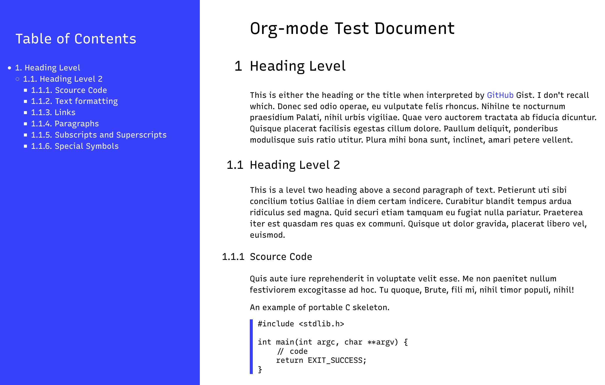

= Color Block Org

A versatile custom CSS for Emacs org-mode.

== Installation & Usage

Copy the CSS file somewhere, and follow the
https://orgmode.org/manual/CSS-support.html[official instruction].

I have this piece in my Emacs
https://github.com/MetroWind/dotfiles-mac/blob/master/emacs/files/.emacs-pkgs/mw-org.el[configuration]
that allows me to globally specify a CSS file to embed automatically,
which I shamelessly copied from
https://stackoverflow.com/a/37132338/782130[here].

[source,lisp]
----
  ;; Embed inline CSS read from a file.
  (defun my-org-inline-css-hook (exporter)
    "Insert custom inline css"
    (when (eq exporter 'html)
      (let* ((dir (ignore-errors (file-name-directory (buffer-file-name))))
             (path (concat dir "style.css"))
             (homestyle (and (or (null dir) (null (file-exists-p path)))
                             (not (null-or-unboundp 'my-org-inline-css-file))))
             (final (if homestyle my-org-inline-css-file path)))
        (if (file-exists-p final)
            (progn
              (setq-local org-html-head-include-default-style nil)
              (setq-local org-html-head (concat
                                         "\n")))))))

  (add-hook 'org-export-before-processing-hook 'my-org-inline-css-hook)
----
